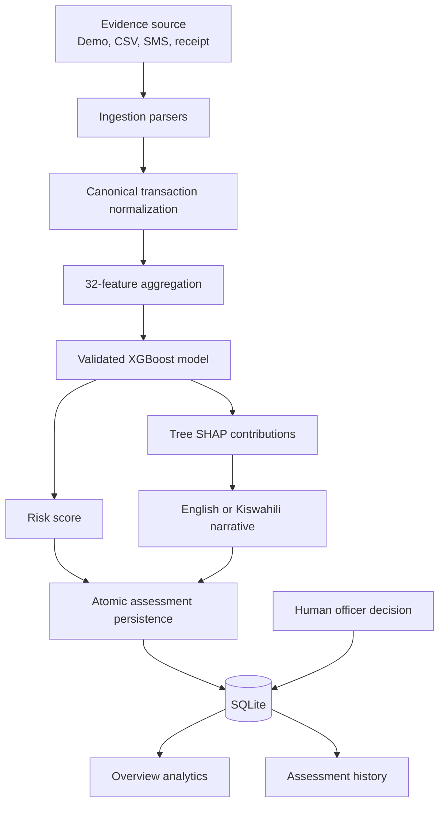
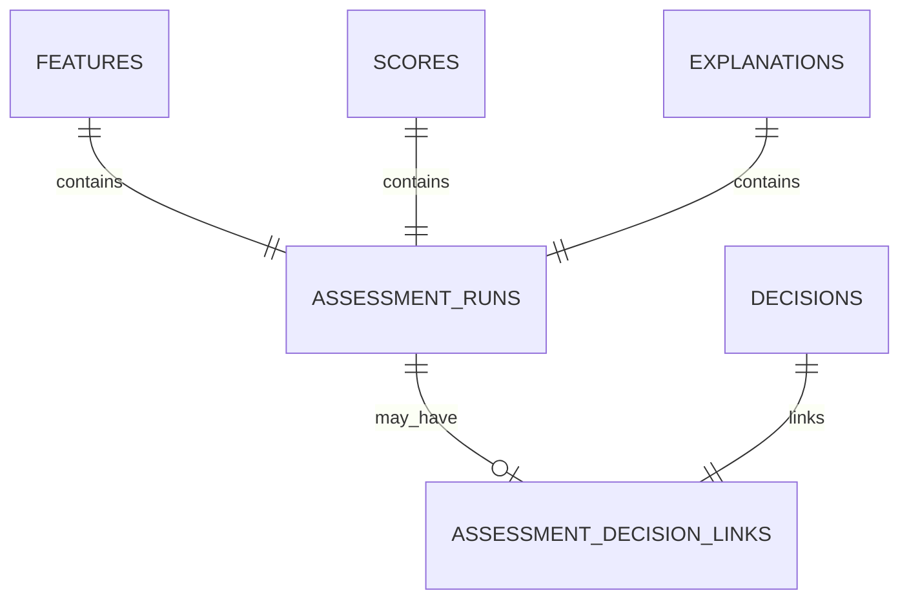

# AkibaAI system guide

This is the primary technical and product guide for AkibaAI. It is written so a
new developer, reviewer, or demonstration operator can understand the whole
system without first reading the source code.

## 1. The system in one paragraph

AkibaAI is an offline-first demonstration of an explainable credit-risk workflow
for SACCO loan officers. It accepts synthetic mobile-money transaction evidence,
validates it, aggregates it into 32 behavioral features, passes those features
to a local XGBoost model, and produces a score between 0 and 1. It then uses SHAP
to show which inputs moved the model output upward or downward. The model result
can be saved to SQLite, after which a human officer may independently record an
approve, review, or decline decision. The Overview and History pages read those
saved records back from SQLite.

The application is a technical MVP. It demonstrates system integration and
responsible workflow separation; it does not prove that mobile-money behavior is
a fair, lawful, or sufficiently accurate basis for real lending.

## 2. What problem AkibaAI explores

Many SACCO members and informal workers have limited conventional credit files.
Their mobile-money history may still contain patterns such as:

- how often money enters and leaves the wallet;
- whether incoming funds are regular or highly variable;
- whether monthly outflows frequently exceed inflows;
- whether the wallet repeatedly reaches a low balance;
- whether balances appear to rise or fall over time; and
- the mix of transfers, withdrawals, airtime, and merchant payments.

AkibaAI explores how those patterns can be transformed into a consistent model
input. It also demonstrates how to show a reviewer the strongest model factors
instead of presenting an unexplained number.

The system intentionally separates three different concepts:

| Concept | Meaning | Owner |
|---|---|---|
| Evidence | Transaction records submitted for an applicant | Input source and officer |
| Model assessment | Risk score plus explanation generated from the evidence | AkibaAI model |
| Lending decision | Approve, review, or decline, with optional rationale | Human officer |

The model never writes the lending decision automatically.

## 3. What AkibaAI does and does not do

AkibaAI does:

- generate synthetic applicants and mobile-money histories;
- parse supported M-Pesa and MTN MoMo-style messages;
- extract receipt text locally with Tesseract OCR;
- accept a structured transaction CSV;
- validate all input through one canonical normalization layer;
- calculate one 32-feature row per applicant;
- load and validate a versioned XGBoost artifact;
- generate a risk score and local SHAP explanation;
- render deterministic English or Kiswahili narratives;
- save linked assessment artifacts atomically to SQLite;
- record a human decision separately from the assessment;
- calculate dashboard analytics from persisted records; and
- run locally or as a persistent Docker Compose VPS demo.

AkibaAI does not:

- connect to a live mobile-network operator;
- use real borrower data in the supplied demonstration;
- define approval thresholds or policy risk bands;
- automatically approve or decline an applicant;
- call ChatGPT or another generative model for explanations;
- provide production identity management or role-based access control;
- encrypt the SQLite database;
- establish model fairness, causal validity, or regulatory compliance; or
- support production-scale concurrent users.

## 4. Architecture

The repository follows a layered design. The Streamlit UI coordinates the user
journey, but business logic remains in reusable Python modules.



### Layer responsibilities

| Layer | Main location | Responsibility |
|---|---|---|
| User interface | `src/ui/` | Navigation, forms, workflow state, visual results |
| Application service | `src/application/` | Orchestrates one complete assessment |
| Domain | `src/domain/` | Canonical transaction types and records |
| Ingestion | `src/ingestion/` | SMS parsing, OCR extraction, validation, normalization |
| Feature engineering | `src/features/` | Aggregates transactions into model-ready features |
| Model | `src/model/` | Training, artifact validation, and prediction |
| Explainability | `src/xai/` | SHAP contributions and localized narratives |
| Storage | `src/storage/` | SQLite schema, transactions, analytics, demo seeding |
| Evaluation | `src/eval/` | Classification metrics and baseline comparison |

This separation means the scoring pipeline can be tested or consumed without
Streamlit, and the UI does not need to reproduce modeling logic.

## 5. End-to-end assessment workflow

The **New Assessment** page guides the officer through five stages.

### Step 1: Choose the applicant

The officer can select a locally generated synthetic member or enter a custom
member ID. Selecting a demo member also provides the synthetic applicant metadata
used by feature engineering. A custom ID can be used with CSV, SMS, or receipt
evidence.

### Step 2: Provide transaction evidence

Four input paths are available:

| Source | Intended use | Notes |
|---|---|---|
| Demonstration data | Fast walkthrough | Uses the selected synthetic member's generated history |
| CSV upload | Structured export | Requires transaction columns described below |
| SMS messages | Provider-message demonstration | Separate messages with a blank line |
| Receipt image | OCR demonstration | PNG/JPG/JPEG processed locally by Tesseract |

The minimum structured fields are:

```csv
timestamp,provider,tx_type,amount,post_balance
2026-08-01 09:30:00,M-Pesa,CASH_IN,2500,8400
```

`applicant_id` may be omitted from a UI upload because the selected applicant
provides that context. The normalizer does not invent missing financial values.

### Step 3: Validate and review

Every source is converted into the same `NormalizedTransaction` domain object.
Validation checks include:

- a non-empty applicant ID;
- supported provider and transaction type;
- a recognized timestamp;
- a finite positive transaction amount;
- a finite, non-negative post-transaction balance;
- consistency between parsed balance fields; and
- consistency between each record and the selected applicant.

Invalid rows are collected as rejected records with understandable error codes;
one invalid row does not hide valid rows in the same batch. Valid records are
sorted deterministically. The UI displays processed, valid, rejected, and warning
counts before allowing scoring.

### Step 4: Run and save the model assessment

The application service receives only validated transactions. It then:

1. confirms that all transactions belong to exactly one applicant;
2. builds one feature row in the model's canonical column order;
3. validates and loads the configured model artifact;
4. calculates the model's estimated default-risk score;
5. calculates Tree SHAP contributions;
6. ranks the strongest upward and downward contributions; and
7. creates a deterministic English or Kiswahili explanation.

The score is displayed as a model output, not as an eligibility decision. The
officer must explicitly save the assessment before moving to the decision stage.
Saving stores the features, score, explanation, narrative, and ingestion audit
counts in one SQLite transaction.

### Step 5: Record the officer decision

After the model assessment is saved, the officer may select `APPROVE`, `REVIEW`,
or `DECLINE`. An optional rationale records additional evidence or judgment. The
decision is stored in its own table and linked to the assessment. This preserves
the difference between what the model produced and what a human decided.

## 6. Input and transaction model

The canonical transaction representation contains:

| Field | Meaning |
|---|---|
| `applicant_id` | Applicant/member identifier |
| `timestamp` | Transaction date and time |
| `provider` | `M-Pesa` or `MTN_MoMo` |
| `tx_type` | Canonical transaction category |
| `amount` | Transaction value, greater than zero |
| `post_balance` | Wallet balance after the transaction |
| `transaction_id` | Optional provider reference |
| `raw_text` | Optional original SMS or OCR text |

Supported categories include peer-to-peer sends and receipts, cash in, cash out,
merchant payments, pay bills, utilities, and airtime. Provider aliases and common
timestamp formats are normalized before feature engineering.

OCR is a real local extraction path, not a mocked response. If Tesseract is not
installed or the image cannot be parsed, the UI reports the failure and does not
substitute synthetic receipt text.

## 7. The 32 behavioral features

Feature engineering reduces a variable-length transaction history to one fixed
row per applicant. The model expects these columns in exactly this order.

### Activity and recency

| Feature | Plain-language meaning |
|---|---|
| `tx_per_month` | Average number of transactions per active month |
| `peak_week_tx` | Highest transaction count observed in one week |
| `active_months` | Number of months containing activity |
| `days_since_last_inflow` | Recency of the latest incoming funds |

### Net cash-flow stability

| Feature | Plain-language meaning |
|---|---|
| `net_flow_total` | Total inflows minus total outflows |
| `net_flow_mean` | Average monthly net flow |
| `net_flow_std` | Variation in monthly net flow |
| `net_flow_cv` | Net-flow variation relative to its mean |
| `net_flow_ratio` | Net flow relative to estimated income |
| `negative_net_months` | Months in which outflows exceeded inflows |

### Incoming funds

| Feature | Plain-language meaning |
|---|---|
| `inflow_total` | Total incoming value |
| `inflow_mean` | Average incoming transaction value |
| `inflow_std` | Variation in incoming transaction values |
| `inflow_cv` | Relative variability of incoming funds |
| `inflow_per_month` | Average incoming-transaction count per month |
| `inflow_regularity` | Consistency of incoming activity |

### Outgoing funds

| Feature | Plain-language meaning |
|---|---|
| `outflow_total` | Total outgoing value |
| `outflow_mean` | Average outgoing transaction value |
| `outflow_std` | Variation in outgoing values |
| `outflow_cv` | Relative variability of outgoing funds |
| `outflow_per_month` | Average outgoing-transaction count per month |
| `productive_ratio` | Share spent on goods and services |
| `inflow_outflow_ratio` | Incoming value relative to outgoing value |

### Wallet balance health

| Feature | Plain-language meaning |
|---|---|
| `low_balance_events` | Count of low-balance observations |
| `low_balance_rate` | Share of observations with a low balance |
| `min_balance` | Lowest observed post-transaction balance |
| `mean_balance` | Average post-transaction balance |
| `balance_trend_slope` | Direction and rate of balance movement over time |

### Transaction mix

| Feature | Plain-language meaning |
|---|---|
| `airtime_ratio` | Share of transactions used for airtime |
| `cashout_ratio` | Share used for cash withdrawals |
| `p2p_send_ratio` | Share of peer-to-peer transfers sent |
| `p2p_receive_ratio` | Share of peer-to-peer transfers received |

These are behavioral summaries, not verified income, affordability, identity,
or character measurements. A feature's presence does not make it a fair or
lawful lending criterion.

## 8. Model training and inference

The bundled artifact is an XGBoost binary classifier identified as `xgb_v1`.
The training command performs the complete reproducible demonstration pipeline:

```bash
python -m src.model.run_training
```

It generates synthetic data, constructs the 32 features, creates a stratified
80/20 split, trains on the training partition, runs five-fold cross-validation,
evaluates the held-out partition, and writes:

| Artifact | Purpose |
|---|---|
| `models/xgb_v1.json` | XGBoost model |
| `models/xgb_v1.meta.json` | Version and expected feature schema |
| `models/xgb_v1.eval.json` | Training metadata and held-out metrics |

The loader validates metadata and feature order before use. It refuses missing,
unreadable, or schema-incompatible artifacts. The UI never trains implicitly.

The included report records 0.9925 held-out AUC and 0.98 accuracy on 50 synthetic
hold-out samples. Those values measure performance against generator-created
labels only; they do not predict performance on real SACCO members.

### Understanding the score

The model returns a value from 0 to 1. A higher value means higher estimated
default risk according to this model. AkibaAI deliberately does not translate
the number into “low,” “medium,” “high,” “eligible,” or “ineligible.” Such a
threshold is a separate lending-policy decision requiring governance.

## 9. Explainability and language support

AkibaAI uses Tree SHAP locally to decompose the model output. Each contribution
contains the feature name, input value, SHAP value, and direction. Positive
contributions push toward higher estimated risk; negative contributions push
toward lower estimated risk.

The narrative layer maps the strongest factors to controlled templates and
human-readable labels in English (`en`) and Kiswahili (`sw`). The score and SHAP
values stay the same when language changes. No translation service, LLM, or
network request is involved, so output is deterministic and works offline.

SHAP explains model behavior, not real-world causation. A feature pushing a score
upward does not prove that the feature caused default.

## 10. SQLite persistence

SQLite is the system of record for saved assessments. The default local path is
`./akiba_ai.db`; Docker uses `/app/runtime/akiba_ai.db` in the persistent
`akiba_data` named volume.



| Table | Stored information |
|---|---|
| `features` | Applicant ID and serialized 32-feature payload |
| `scores` | Applicant ID, risk score, and model version |
| `explanations` | SHAP payload plus localized narrative |
| `assessment_runs` | Links one feature, score, and explanation; stores source and validation counts |
| `decisions` | Human decision label, rationale, applicant, and timestamp |
| `assessment_decision_links` | Associates at most one decision with one assessment |

Assessment persistence is atomic: if any linked insert fails, the transaction is
rolled back rather than leaving a partial assessment. Decisions use a separate
call because they belong to the human review stage.

SQLite persists beyond a browser session because data is written to disk. In
Docker, restarts, rebuilds, and `docker compose down` preserve the named volume.
`docker compose down -v` deletes it and must be used only intentionally.

## 11. User interface pages

### Overview

Overview reads persisted data, not temporary browser state. It shows total
assessments, decisions, assessments awaiting decisions, ingestion warnings,
decision activity, score distribution, evidence sources, ingestion quality, and
the five most recent assessments. Score intervals are histogram bins, not policy
bands.

### New Assessment

This is the five-step workflow described earlier. Session state preserves the
current unsaved workflow across Streamlit reruns. Only **Save assessment** creates
a durable database record.

### History

History lists persisted assessments newest first and joins each one to its
optional officer decision. Search performs a case-insensitive partial match on
applicant ID. History survives browser sessions because it comes from SQLite.

### Settings

Settings shows live row counts, can load 12 idempotent synthetic dashboard
records, and can reset all assessment tables. Reset requires the Settings key and
typing `RESET`. It preserves model files and configuration. **Lock settings**
clears access for the current browser session.

## 12. Analytics definitions

All dashboard numbers are SQL aggregates over saved assessment runs:

| Metric | Calculation |
|---|---|
| Assessments | Count of `assessment_runs` |
| Decisions recorded | Runs with a linked decision |
| Awaiting decision | Runs without a linked decision |
| Ingestion warnings | Sum of saved warning counts |
| Decision activity | Linked decisions grouped by label |
| Evidence sources | Runs grouped by `source_key` |
| Ingestion quality | Sums of processed/valid/rejected/warning counts |
| Score distribution | Counts in 0.00–0.24, 0.25–0.49, 0.50–0.74, and 0.75–1.00 |

The 12-record dashboard seed is safe to run repeatedly and does not duplicate
records already created by that seeder.

## 13. Configuration

| Variable | Local default | Purpose |
|---|---|---|
| `APP_ENV` | `development` | Environment label |
| `DB_PATH` | `./akiba_ai.db` | SQLite file location |
| `MODEL_PATH` | `./models/xgb_v1.json` | XGBoost artifact location |
| `SETTINGS_ACCESS_KEY` | `CMU#AB39` | Settings data-control key |
| `PYTHONPATH` | Project root in deployment | Makes `src` importable |

Copy `.env.example` to `.env` for deployment values. `.env` and database files
are excluded from Git and the Docker build context.

## 14. Security and privacy boundaries

The VPS configuration is suitable only for a controlled demonstration:

- the Settings key protects Settings data controls, not the whole app;
- the shared key is not identity or role-based authorization;
- direct HTTP on port 8501 does not provide TLS;
- SQLite is not encrypted at rest;
- access is not audited by user identity; and
- uploaded evidence should remain synthetic.

Before any real-data pilot, add HTTPS, authentication and roles, secret
management, encryption, consent and retention controls, audit logging, backups,
security review, and a production database strategy.

## 15. Development, deployment, and testing

### Local setup

```bash
python -m venv .venv

# Windows PowerShell
.venv\Scripts\Activate.ps1

# Linux/macOS
source .venv/bin/activate

pip install -r requirements.txt
streamlit run src/ui/app.py
```

Useful commands:

```bash
python -m src.model.run_training
python -m src.storage.seed_dashboard_demo
pytest -q
black --check src tests
flake8 src tests
```

Tesseract must be installed at operating-system level for local receipt OCR. The
Docker image installs it automatically.

### VPS demo

```bash
cp .env.example .env
docker compose up -d --build
docker compose ps
docker compose logs --tail=100 akiba-ai
```

For an update that preserves SQLite:

```bash
git pull
docker compose up -d --build --force-recreate
```

See [VPS_DEPLOYMENT.md](VPS_DEPLOYMENT.md) for firewall, backup, troubleshooting,
and operational commands.

### Automated coverage

The 157-test suite covers synthetic data, feature calculations, model loading and
prediction, SMS parsing, normalization, SHAP reconstruction, narratives, atomic
persistence, analytics, data reset, and the Streamlit workflow. Passing tests
confirm the repository contract; they do not validate real-world lending use.

## 16. Repository map

```text
akiba-ai/
├── src/
│   ├── application/     assessment orchestration
│   ├── data_gen/        synthetic applicant and transaction generation
│   ├── domain/          canonical transaction objects
│   ├── eval/            model evaluation metrics
│   ├── features/        32-feature aggregation
│   ├── ingestion/       SMS, OCR, and normalization
│   ├── model/           training, artifact loading, and prediction
│   ├── storage/         SQLite schema, persistence, analytics, seeding
│   ├── ui/              Streamlit views, state, and theme
│   └── xai/             SHAP and localized narratives
├── models/              reviewed model and metadata
├── tests/               automated test suite
├── docs/                system, schema, and deployment guides
├── Dockerfile           demo image
├── compose.yaml         VPS service and persistent volume
├── requirements.txt     development/runtime dependencies
└── requirements-prod.txt container runtime dependencies
```

## 17. Known limitations and responsible-use risks

### Synthetic-target leakage

The synthetic default label is created from rules related to behavioral patterns
later used as features. The model can score extremely well by recovering the
generator's rules. High synthetic metrics are not evidence of generalization.

### Statistical and fairness limitations

- Personas are simplified representations of financial behavior.
- The hold-out data comes from the same generator as training data.
- No temporal, geographic, provider, or out-of-distribution validation exists.
- The score is not independently calibrated on real outcomes.
- Mobile-money behavior may proxy for protected or socioeconomic characteristics.
- SHAP transparency does not make a feature fair or lawful.
- There is no adverse-action, affordability, or appeal workflow.

### Engineering limitations

- SQLite is not a high-concurrency production database.
- Settings protection is a shared session key, not full authentication.
- There is no centralized monitoring or identity audit trail.
- OCR and SMS support cover only demonstration formats.

## 18. What production readiness would require

Moving beyond the demonstration would require at least:

1. a consented, representative, legally obtained dataset;
2. documented targets and leakage controls;
3. temporal and out-of-sample validation;
4. fairness, explainability, and regulatory review;
5. an approved lending policy separate from model output;
6. authentication, authorization, TLS, encryption, and secret management;
7. immutable audit events and controlled data retention;
8. a managed concurrent database;
9. model monitoring, version governance, and rollback;
10. operational monitoring and tested disaster recovery; and
11. a human appeal and correction process.

## 19. Glossary

| Term | Meaning in AkibaAI |
|---|---|
| Applicant/member | Person whose synthetic evidence is assessed |
| Assessment | Saved features, score, explanation, narrative, and audit metadata |
| Decision | Separate human approve/review/decline record |
| Feature | Numeric behavioral summary supplied to the model |
| Inflow/outflow | Money entering/leaving the mobile wallet |
| Model artifact | Saved XGBoost parameters in `models/xgb_v1.json` |
| Normalization | Validation and conversion into one transaction schema |
| Risk score | 0–1 model output; higher means higher estimated default risk |
| SHAP value | Contribution showing how a feature moved the model output |
| Synthetic data | Artificial records generated for testing and demonstration |

## 20. Quick troubleshooting

| Symptom | Likely cause | Action |
|---|---|---|
| `No module named 'src'` | Project root missing from Python path | Pull the current deployment files and rebuild with `--force-recreate` |
| Model setup required | Artifact missing or `MODEL_PATH` incorrect | Use the bundled model or run training |
| OCR error | Tesseract missing or image unreadable | Install Tesseract and use a clear image |
| Dashboard empty | No saved assessments | Complete and save one or load demo data in Settings |
| Docker data disappears | Volume missing or deleted | Confirm `akiba_data:/app/runtime`; avoid `down -v` |
| Settings will not unlock | Deployment key differs | Check `SETTINGS_ACCESS_KEY` and recreate the container |

## 21. Final perspective

AkibaAI's most important design choice is the traceable sequence from evidence,
through validation, features, score, and explanation, to a separately owned
human decision. That sequence makes each stage inspectable and replaceable. The
current implementation is a strong demonstration of that architecture, while
its synthetic-data and security limitations remain explicit.
